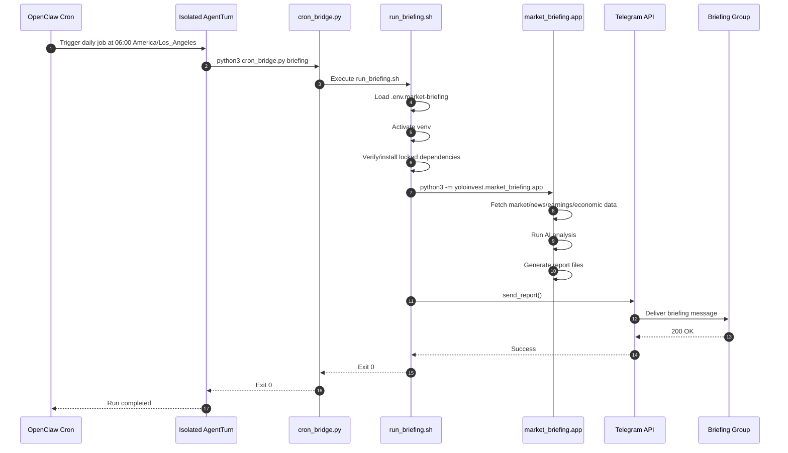
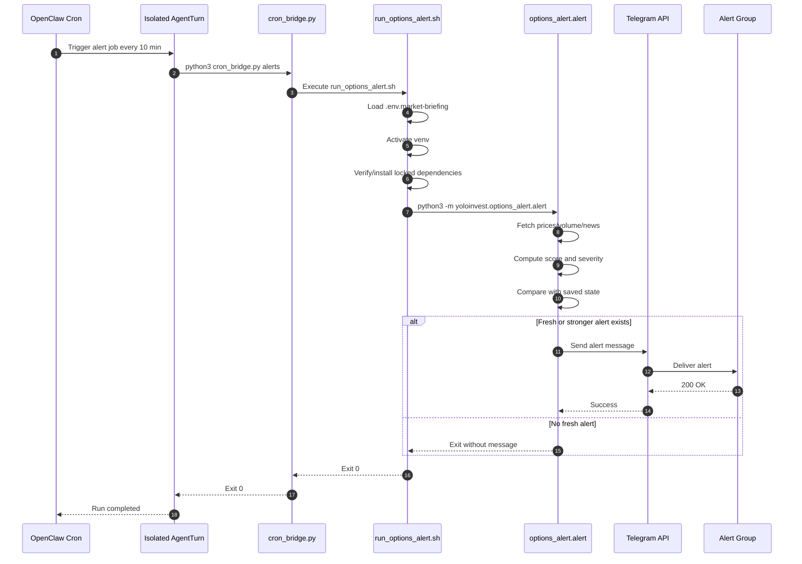
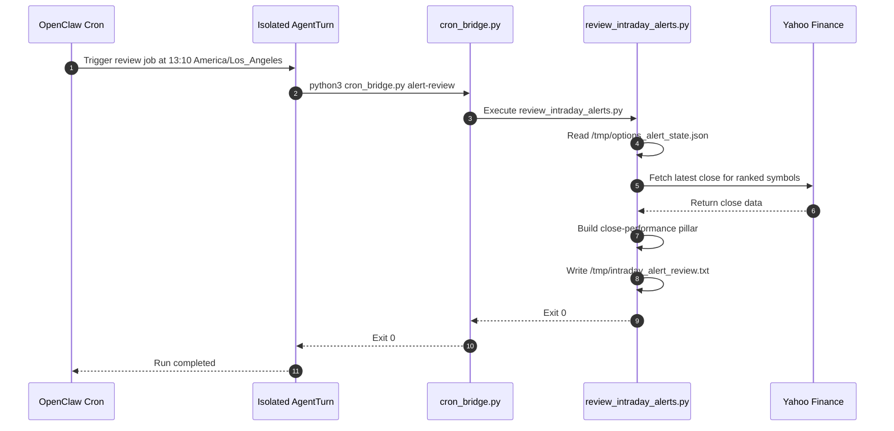
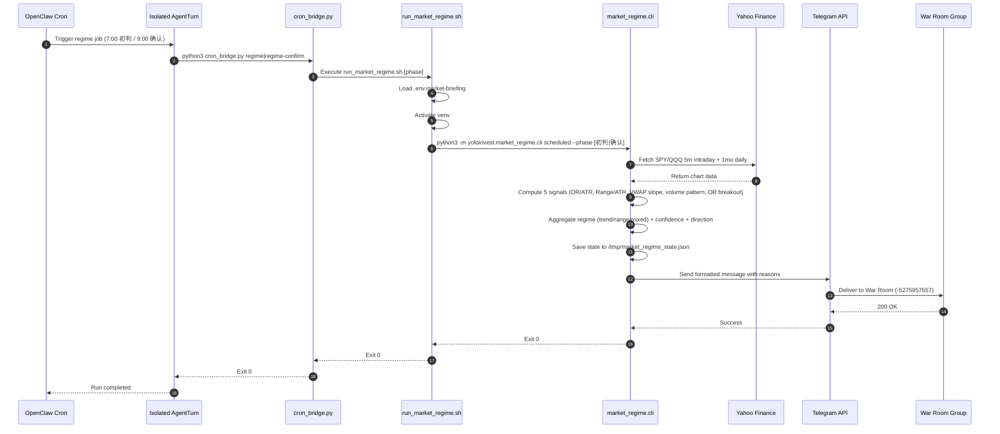
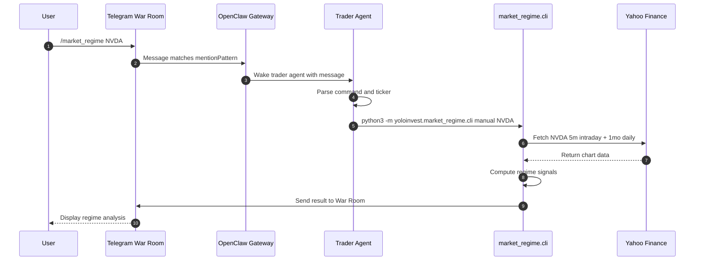

# Architecture

## Overview

Release line: `v2.1.0`

YoloInvest has two production workflows:
- `market_briefing`: daily market briefing generation and Telegram delivery
- `options_alert`: intraday alert scanning, alert delivery, and end-of-day review

The project is scheduled through OpenClaw cron, but execution is stabilized by a thin Python bridge so cron-triggered agent turns do not need to reason about the business workflow.

## Runtime Layers

- OpenClaw cron: scheduler
- isolated `agentTurn`: task trigger surface
- `cron_bridge.py`: deterministic command bridge
- shell entrypoints: environment setup and command orchestration
- Python modules: data fetch, analysis, formatting, delivery
- Telegram: final delivery surface

## Daily Briefing Sequence

## Intraday Alert Sequence

## End-of-Day Review Sequence

## Market Regime Detection Sequence

### Manual Trigger (via Telegram group)

### Regime Detection Signals

| Signal | Trend | Range |
|--------|-------|-------|
| Opening Range / ATR | > 60% | < 40% |
| Day Range / ATR | > 80% | < 50% |
| VWAP Slope | > 0.3% drift | < 0.15% drift |
| Volume Pattern | Increasing > 20% | Decreasing > 20% |
| OR Breakout | Price outside OR | Price inside OR |

Each signal contributes a weighted score. Final regime is determined by trend_score vs range_score ratio, with confidence levels (high/medium/low).

## Cron Topology

- `yoloinvest-market-briefing-daily`
  - `0 6 * * *`
  - `America/Los_Angeles`
- `yoloinvest-intraday-tech-alerts`
  - `*/10 30-59 6 * * 1-5`
  - `America/Los_Angeles`
- `yoloinvest-intraday-tech-alerts-core`
  - `*/10 7-12 * * 1-5`
  - `America/Los_Angeles`
- `yoloinvest-intraday-tech-alerts-close`
  - `0 13 * * 1-5`
  - `America/Los_Angeles`
- `yoloinvest-intraday-alert-review`
  - `10 13 * * 1-5`
  - `America/Los_Angeles`
- `yoloinvest-market-regime-initial`
  - `0 7 * * 1-5`
  - `America/Los_Angeles`
  - SPY/QQQ 区间日/趋势日初判（开盘30min后）
- `yoloinvest-market-regime-confirm`
  - `0 9 * * 1-5`
  - `America/Los_Angeles`
  - 盘中确认/修正判断

## Why `cron_bridge.py` Exists

OpenClaw cron isolated jobs run through `agentTurn`, not a raw shell runner. In practice this means a natural-language cron prompt can introduce unnecessary uncertainty around tool execution and completion. `cron_bridge.py` reduces that uncertainty by giving cron a single deterministic command target.

Execution model:
- cron -> isolated agentTurn
- isolated agentTurn -> `cron_bridge.py`
- `cron_bridge.py` -> canonical shell entrypoint or review script

That keeps the scheduler simple and makes debugging easier because each layer has one responsibility.
